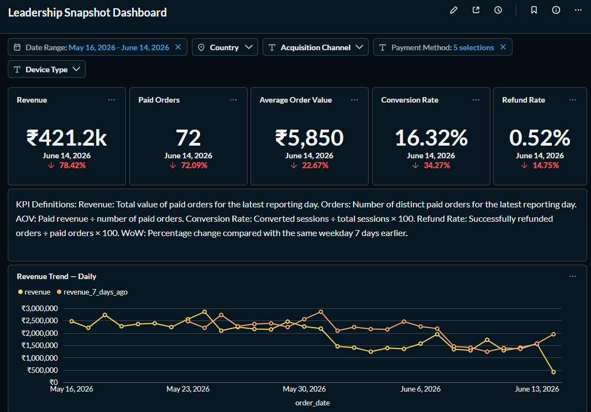

# SQL Stakeholder Dashboards

Stakeholder-focused analytics dashboards built in Metabase using the `ecom` dataset.

This project contains two dashboards designed for different decision-makers:

- **Leadership Snapshot** — executive business-health monitoring
- **Ops/CX Dashboard** — operational monitoring and issue investigation

## Project Deliverables

### 1. Leadership Snapshot Dashboard
- 5 hero KPI Number tiles
- Revenue and Paid Orders trends
- Revenue by Country
- Revenue by Acquisition Channel
- Daily diagnostic table

See: [`dashboards/leadership/`](dashboards/leadership/)

### 2. Ops/CX Dashboard
- On-Time Delivery %
- Payment Failure Rate
- Refund Rate
- Order Fulfilment Funnel
- Fulfilment-time analysis
- Region/Courier delivery performance
- Payment failure weekly trend
- Refund analysis
- Stuck orders requiring action

See: [`dashboards/ops-cx/`](dashboards/ops-cx/)

## Product Requirements Documents

- [Leadership Snapshot PRD](prds/leadership_snapshot_prd.md)
- [Ops/CX Dashboard PRD](prds/ops_cx_prd.md)

## Metric Definitions

Canonical metric definitions and cross-dashboard validation:

[Metric Definitions](metric-definitions/metric_definitions.md)

The Refund Rate consistency audit validated:

- Leadership Snapshot: **0.69%**
- Ops/CX Dashboard: **0.7%**
- Manual validation: **8 / 1,162 × 100 = 0.69%**
- Result: **PASS**

## Anomaly Investigations

1. [Revenue Decline — June 14, 2026](anomaly-investigations/anomaly_01.md)
2. [Below-Target On-Time Delivery Performance](anomaly-investigations/anomaly_02.md)

## Executive 1-Pager



## Design Approach

The dashboards follow a stakeholder-first information hierarchy:

**KPIs → Trends → Breakdowns → Diagnostics**

Visualization choices were refined to reduce unnecessary tables:

- KPI cards for current-state metrics
- Line charts for trends
- Ranked bar charts for comparisons
- Tables only where row-level operational action is required

## Tools

- PostgreSQL
- SQL
- Metabase
- Notion
- Git / GitHub

## Repository Structure

```text
sql-stakeholder-dashboards/
├── dashboards/
│   ├── leadership/
│   └── ops-cx/
├── prds/
├── metric-definitions/
├── anomaly-investigations/
├── screenshots/
└── README.md